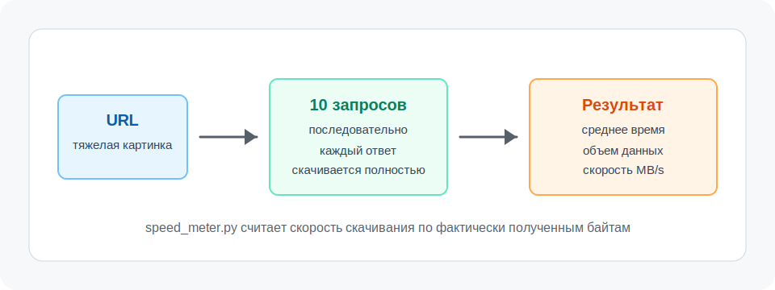
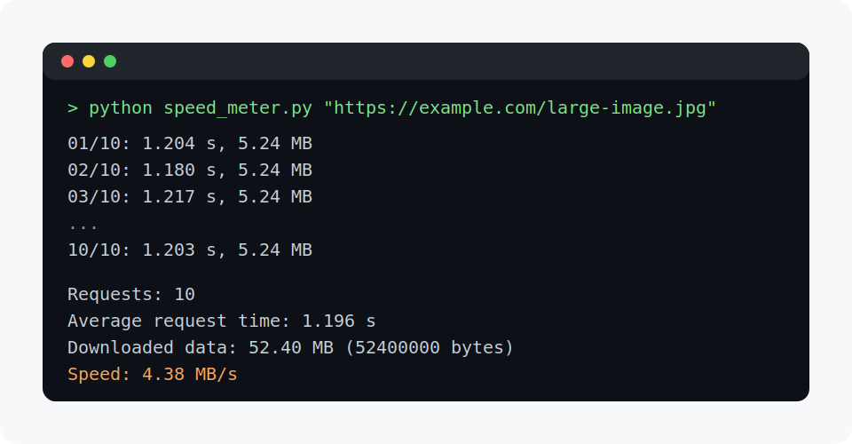

# Замер скорости интернета

Python-скрипт для замера скорости скачивания с компьютера до указанного URL.
В качестве адреса удобно передавать тяжелую картинку, архив или другой большой файл.



## Что делает скрипт

- принимает URL файла для скачивания;
- запускает 10 последовательных HTTP-запросов по умолчанию;
- дожидается полной загрузки ответа на каждый запрос;
- считает среднее время одного запроса;
- считает общий объем скачанных данных;
- выводит скорость скачивания в `MB/s`.

## Требования

- Python 3.10 или новее;
- дополнительные библиотеки не нужны.

## Как запустить

Склонируйте репозиторий и перейдите в папку проекта:

```bash
git clone https://github.com/DeStep3000/ad-robot.git
cd ad-robot
```

Запустите скрипт, передав ссылку на большой файл:

```bash
python speed_meter.py "https://example.com/large-image.jpg"
```

По умолчанию будет выполнено 10 запросов.

## Примеры запуска

Запуск с количеством запросов по умолчанию:

```bash
python speed_meter.py "https://example.com/large-image.jpg"
```

Запуск с другим количеством запросов:

```bash
python speed_meter.py "https://example.com/large-image.jpg" --requests 5
```

То же самое через короткий параметр:

```bash
python speed_meter.py "https://example.com/large-image.jpg" -n 5
```

Запуск с увеличенным таймаутом:

```bash
python speed_meter.py "https://example.com/large-image.jpg" --timeout 120
```

## Пример вывода



```text
01/10: 1.204 s, 5.24 MB
02/10: 1.180 s, 5.24 MB
03/10: 1.217 s, 5.24 MB
04/10: 1.190 s, 5.24 MB
05/10: 1.201 s, 5.24 MB
06/10: 1.175 s, 5.24 MB
07/10: 1.209 s, 5.24 MB
08/10: 1.188 s, 5.24 MB
09/10: 1.196 s, 5.24 MB
10/10: 1.203 s, 5.24 MB

Requests: 10
Average request time: 1.196 s
Downloaded data: 52.40 MB (52400000 bytes)
Speed: 4.38 MB/s
```

## Как это работает

Скрипт скачивает файл несколько раз подряд и замеряет время каждого скачивания.
После завершения всех запросов он складывает время и объем данных, а затем считает скорость:

```text
скорость = общий объем скачанных данных / общее время скачивания
```

В выводе используется мегабайт в десятичном формате:

```text
1 MB = 1 000 000 bytes
```

## Рекомендации

Для более точного результата используйте файл, который скачивается хотя бы несколько секунд.
Слишком маленький файл может дать неточный замер, потому что на результат сильнее влияют
установка соединения, кеширование сервера и кратковременные колебания сети.

## Структура проекта

```text
.
├── assets/
│   ├── console-output.svg
│   └── speed-meter-flow.svg
├── speed_meter.py
├── README.md
└── LICENSE
```
